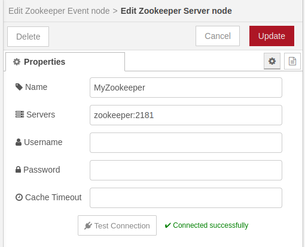
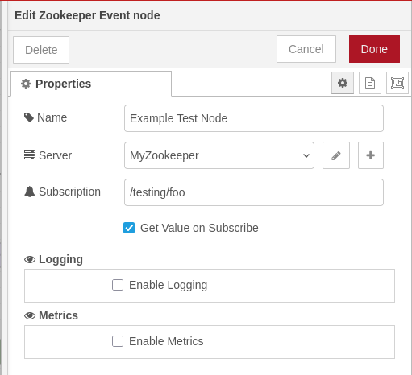
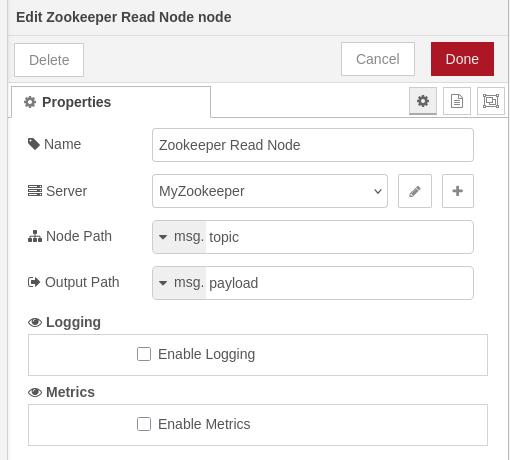
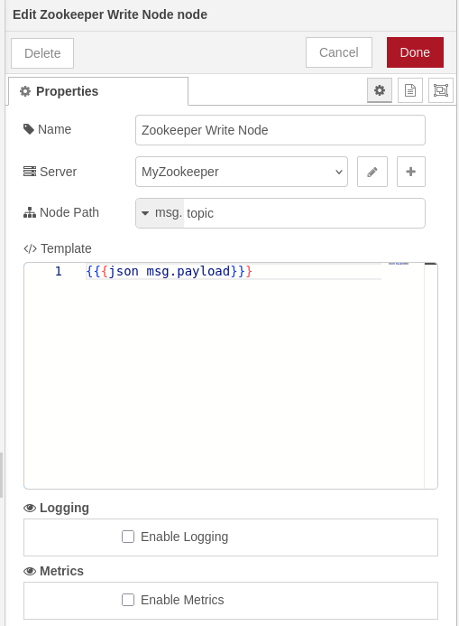
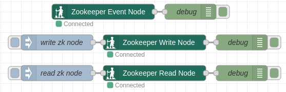

# @theotherwillembotha/node-red-zookeeper

Apache ZooKeeper integration nodes for Node-RED. Built on [@theotherwillembotha/node-red-plugincore](https://github.com/theotherwillembotha/nodered_plugincore).

---

## Nodes

| Node | Description |
|------|-------------|
| **Zookeeper Server** | Config node - defines a connection to a ZooKeeper ensemble. Shared across all ZooKeeper nodes in the flow. |
| **Zookeeper Event** | Subscribes to a ZooKeeper node path and emits a message each time the value changes. |
| **Zookeeper Read** | Reads the current value of a ZooKeeper node on demand when a message arrives. |
| **Zookeeper Write** | Writes data to a ZooKeeper node when a message arrives. Creates intermediate paths automatically. |

---

## Installation

Either use the **Manage Palette** option in the Node-RED editor, or run the following command in your Node-RED user directory (typically `~/.node-red`):

```bash
npm install @theotherwillembotha/node-red-zookeeper
```

> [!IMPORTANT]
> **This plugin requires [`@theotherwillembotha/node-red-plugincore`](https://github.com/theotherwillembotha/nodered_plugincore) to be installed.**
>
> `node-red-plugincore` is declared as a dependency and npm will install it automatically alongside this package. However, due to a [known Node-RED limitation](https://github.com/node-red/node-red/issues/3529), packages that arrive as transitive npm dependencies are only discovered by the Node-RED runtime on the **next startup**.
>
> **You have two options:**
> - Install [`@theotherwillembotha/node-red-plugincore`](https://flows.nodered.org/node/@theotherwillembotha/node-red-plugincore) via the palette manager or `npm install` **first**, then install this plugin - both will be available immediately without a restart.
> - Install this plugin directly - `node-red-plugincore` will be installed automatically alongside it. **Restart Node-RED** once and both packages will be fully loaded.

---

## Node Details

### Zookeeper Server (Config Node)

Connects to a ZooKeeper ensemble and manages the underlying client lifecycle. All ZooKeeper flow nodes reference a single config node, so only one connection is maintained per ensemble.



| Field | Description |
|-------|-------------|
| **Name** | Display label for this config node |
| **Servers** | Comma-separated list of ZooKeeper server addresses (e.g. `zookeeper:2181` or `host1:2181,host2:2181`) |
| **Username** | Optional authentication username |
| **Password** | Optional authentication password |
| **Cache Timeout** | Optional cache timeout value |

Use the **Test Connection** button to verify connectivity before saving. The result is shown inline without saving the node.

---

### Zookeeper Event Node

Subscribes to a ZooKeeper node path and emits a message each time the value at that path changes.



| Field | Description |
|-------|-------------|
| **Name** | Display label for this node |
| **Server** | The Zookeeper Server config node to use |
| **Subscription** | The ZooKeeper node path to watch (e.g. `/my/service/config`) |
| **Get Value on Subscribe** | If enabled, immediately reads and emits the current value when the subscription is first established - including on flow deployment |

**Output:**

| Property | Value |
|----------|-------|
| `msg.topic` | The ZooKeeper path that changed |
| `msg.payload` | The new value - parsed as JSON if possible, otherwise a plain string |

The node status indicator shows **Connected** (green dot) or **Disconnected** (red dot) in real time. If the subscribed path does not yet exist, the node waits and begins watching as soon as it is created.

---

### Zookeeper Read Node

Reads the current value of a ZooKeeper node whenever a message is received.



| Field | Description |
|-------|-------------|
| **Name** | Display label for this node |
| **Server** | The Zookeeper Server config node to use |
| **Node Path** | The ZooKeeper path to read. Supports `msg`, `flow`, `global`, and `str` (literal) types |
| **Output Path** | Where to write the result in the output message. Supports `msg`, `flow`, and `global` types |

The input message passes through unchanged except for the value written at **Output Path**. The value is parsed as JSON if possible; otherwise written as a plain string.

**Node Path examples:**

| Type | Value | Resolves to |
|------|-------|-------------|
| `str` | `/services/config` | literal path `/services/config` |
| `msg` | `topic` | value of `msg.topic` at runtime |
| `flow` | `zkpath` | value of the `zkpath` flow context variable |

---

### Zookeeper Write Node

Writes data to a ZooKeeper node whenever a message is received. Intermediate paths are created automatically as persistent nodes if they do not already exist.



| Field | Description |
|-------|-------------|
| **Name** | Display label for this node |
| **Server** | The Zookeeper Server config node to use |
| **Node Path** | The ZooKeeper path to write to. Supports `msg`, `flow`, `global`, and `str` (literal) types |
| **Template** | A [Handlebars](https://handlebarsjs.com/) template for the data to write. The incoming message is available as `msg` |

The input message passes through unchanged on successful write.

**Template examples:**

| Template | Description |
|----------|-------------|
| `{{{json msg.payload}}}` | Serialise the full payload as a JSON string |
| `{{msg.payload.value}}` | Write a single field as a plain string |
| `{"ts":"{{msg._msgid}}"}` | Construct a JSON string inline |

---

## Example Flow

The three flow nodes in action - an event listener, a write trigger, and a read trigger, all connected to the same ZooKeeper server config node:



---

## Prerequisites

- Node.js 18+
- Node-RED 3+
- A running [Apache ZooKeeper](https://zookeeper.apache.org/) instance or ensemble reachable from your Node-RED host

---

## Repository

- Source: [github.com/theotherwillembotha/nodered_zookeeper](https://github.com/theotherwillembotha/nodered_zookeeper)
- Issues: [github.com/theotherwillembotha/nodered_zookeeper/issues](https://github.com/theotherwillembotha/nodered_zookeeper/issues)

## License

[ISC](LICENSE)
